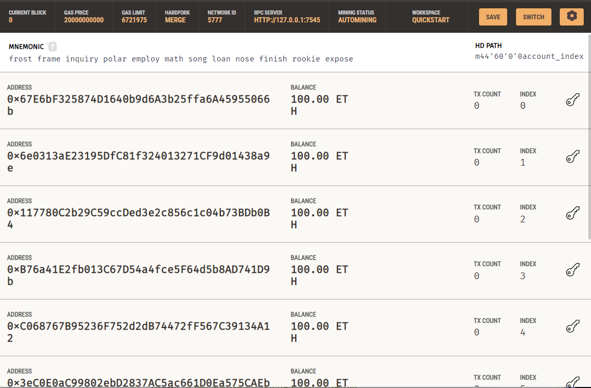
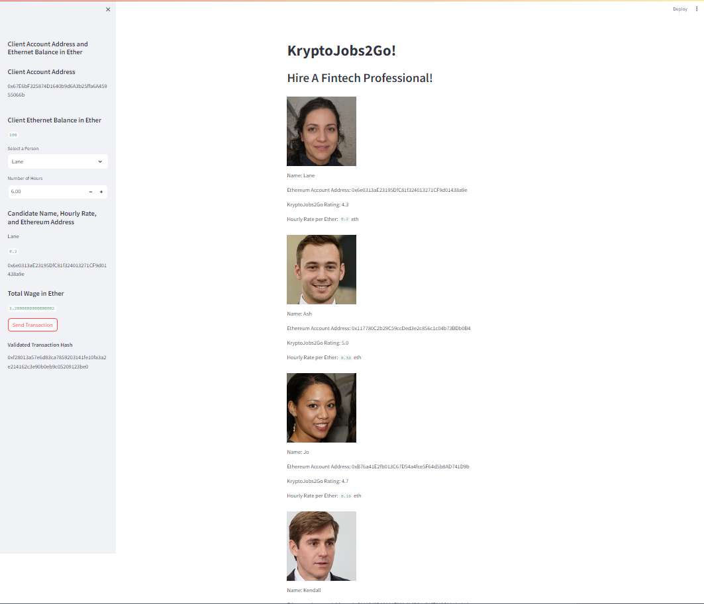
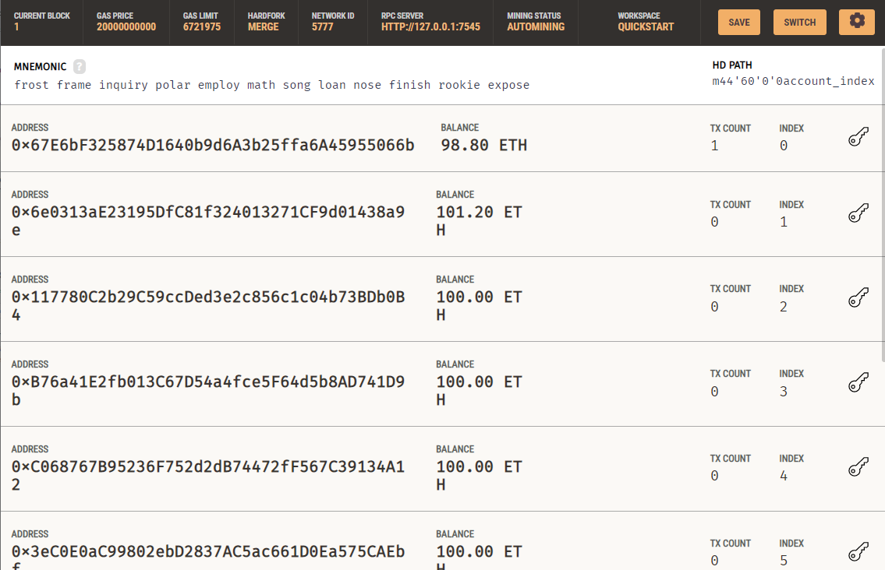
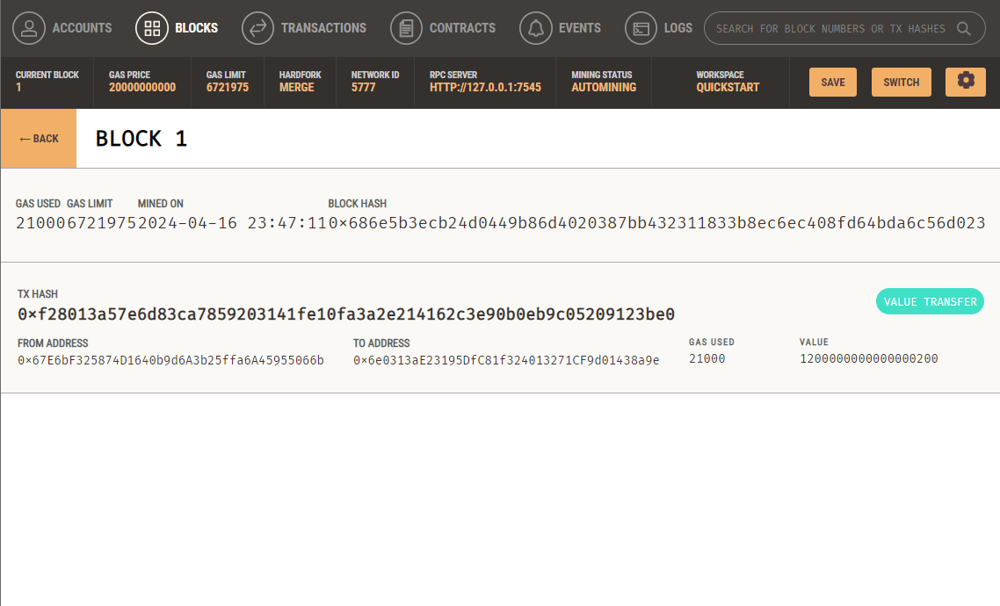

# Challenge-19

Before transaction, the first address is client account address and the rest 4 addresses are candidates address as Fig.1 

To demonstate streamlit run results of the krypto_jobs.py, I choose "Lane" with working 6 hours as a testing example and click "Send Transaction" button as shown in  Fig.2 

The after transaction accounts balance changes of sender's account (1st account) and the receiver's account (2nd account) can be shown in Fig.3 

The block detail of the transaction "TX HASH" and "VALUE" shown in Fig.4  and "TX" value of Transaction and transfered "VALUE" of "1.2 ETH" in Fig.5 [alt="transaction block"](Images/transaction.png) are the same with the "Validated Transaction Hash" and "Total Wage in Ether" respectively as shown in Fig.2, which verifies the validation is correct.

